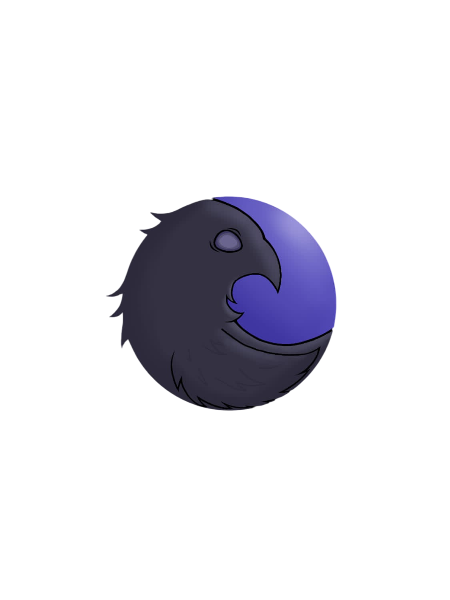

# 🐦 CrowD
**A rede social de aluno para aluno: Conectividade, Comunidade e Colaboração.**

  

---

## 📌 Sobre o Projeto

O **CrowD** nasceu como meu Trabalho de Conclusão de Curso (TCC) na Etec Albert Einstein. Ele foi idealizado para preencher uma lacuna de comunicação e integração entre estudantes, criando um ambiente seguro e funcional para troca de informações, organização de eventos e fortalecimento de laços acadêmicos.

Este projeto representa minha transição para o desenvolvimento de sistemas escaláveis, unindo uma interface moderna com uma infraestrutura robusta em nuvem.

---

## 🛠️ Funcionalidades Técnicas (Features)

Como líder de desenvolvimento, projetei o CrowD para ser modular e responsivo, utilizando as melhores práticas de **Backend as a Service (BaaS)**:

* **💬 Chat em Tempo Real:** Sistema de mensagens instantâneas utilizando a agilidade do Firebase.
* **👥 Gestão de Clubes e Grupos:** Espaços dedicados para interesses específicos dentro da comunidade estudantil.
* **📅 Sistema de Eventos:** Calendário interativo para criação e acompanhamento de atividades acadêmicas e sociais.
* **👤 Perfis Customizáveis:** Gestão de identidade do usuário com suporte a foto de perfil e biografia.
* **🛡️ Moderação e Denúncias:** Sistema integrado para garantir a segurança e o respeito dentro da plataforma.
* **🌙 Modo Escuro (Dark Mode):** Interface adaptativa para melhor experiência de uso em qualquer ambiente.

---

## 🚀 Stack Tecnológica

O projeto foi construído utilizando tecnologias de ponta para garantir performance e facilidade de deploy:

* **Frontend:** HTML5, CSS3 (Global Styles) e JavaScript Assíncrono.
* **Backend:** Node.js para lógica de processamento.
* **Banco de Dados & Auth:** **Firebase** (Firestore para dados e Firebase Auth para segurança).
* **Hosting:** Infraestrutura escalável do Google Firebase.

---

## 📈 Minha Evolução

Este repositório é o registro de um marco importante:
- **O Início:** Reflete o domínio de lógica de programação web e mobile aprendido na Etec, lidando com integração de APIs e banco de dados NoSQL pela primeira vez.
- **O Futuro:** Atualmente, utilizo os fundamentos de arquitetura aplicados aqui para avançar em meus estudos na **FIAP**, focando em Engenharia de Software e Inteligência Artificial.

---

## 📖 Como Executar

Por ser uma aplicação baseada em Firebase, o CrowD está configurado para Web Hosting.

1.  Clone o repositório.
2.  Instale o Firebase CLI: `npm install -g firebase-tools`.
3.  Inicie o servidor local: `firebase serve`.
4.  Acesse `localhost:5000` no seu navegador.

---

## 📄 Licença e Direitos Autorais

  <strong>Copyright (c) 2026 Lucas Barreto. Todos os direitos reservados.</strong>

Este código é disponibilizado apenas para **exibição de portfólio técnico**. 
* **Permitido:** Visualização e análise técnica por recrutadores e desenvolvedores.
* **Proibido:** Cópia integral, redistribuição ou uso comercial sem autorização expressa do autor.

---

### 📫 Conecte-se com o grupo:

*Building scalable solutions for the future.*

